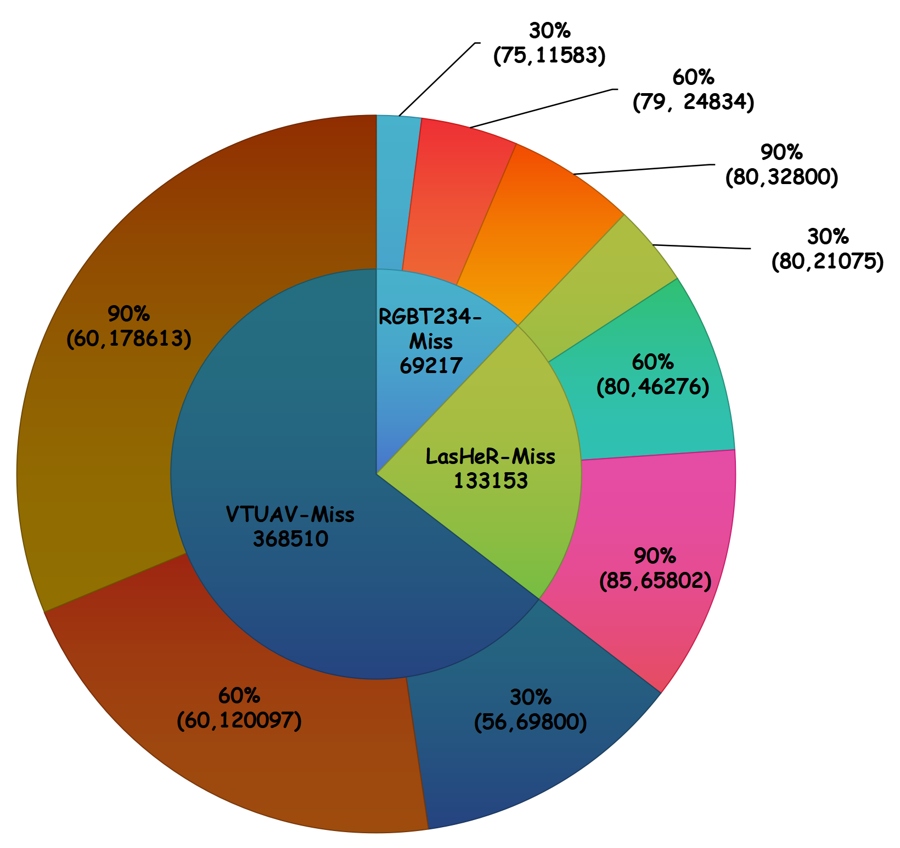
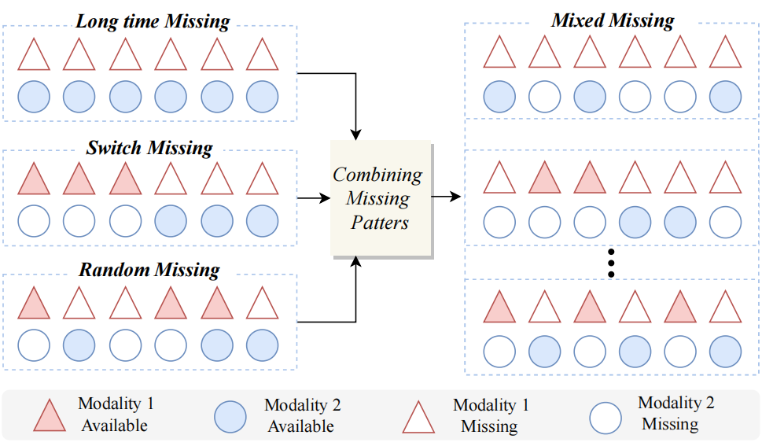
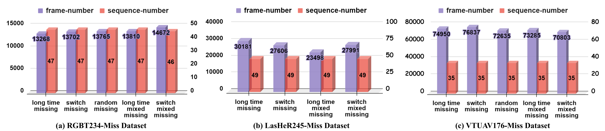

# Modality-missing RGBT Tracking: Invertible Prompt Learning and High-quality Benchmarks

Current RGBT tracking research relies on the complete multi-modal input, but modal information might miss due to some factors such as thermal sensor self-calibration and data transmission error, called modality-missing challenge in this work. To address this challenge, we propose a novel invertible prompt learning approach, which integrates the content-preserving prompts into a well-trained tracking model to adapt to various modality-missing scenarios, for robust RGBT tracking.
Given one modality-missing scenario, we propose to utilize the available modality to generate the prompt of the missing modality to adapt to RGBT tracking model. However, the cross-modality gap between available and missing modalities usually causes semantic distortion and information loss in prompt generation. To handle this issue, we design the invertible prompter by incorporating the full reconstruction of the input available modality from the generated prompt.
To provide a comprehensive evaluation platform, we construct several high-quality benchmark datasets, in which various modality-missing scenarios are considered to simulate real-world challenges.
Extensive experiments on three modality-missing benchmark datasets show that our method achieves significant performance improvements compared with state-of-the-art methods.

## Modality-missing Dataset

We will release the dataset and model code step-by-step.

Modality-missing Dataset is released
